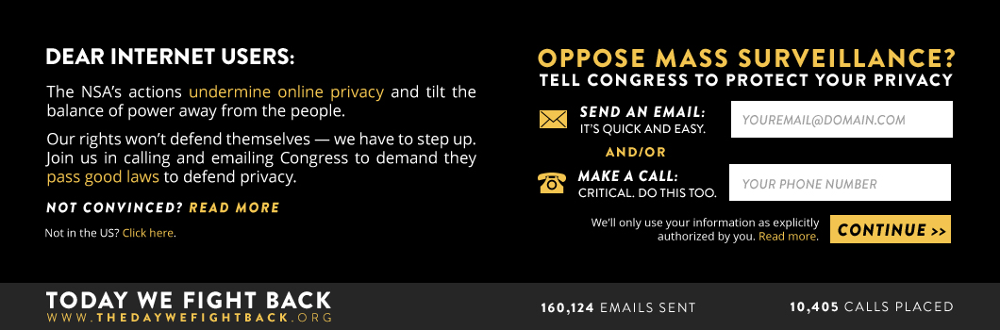

# thedaywefightback.js

thedaywefightback.js is a javascript snippet that automatically activates at midnight of February 11th and adds a banner to your site for 24 hours in support of [thedaywefightback.org](https://thedaywefightback.org).



You can add it to your site now - it won't be activated until midnight EST on February 11th. You can also host the files locally.

**If you own a website, no matter how big or small, you can be part of this.**

## Some things to know
* If users are outside the US, a different version of the banner will be shown with appropriate actions.

## Other ways to install

* Cloudflare app
* Wordpress pluging
* Drupal plugin

## Getting started

Simply copy and paste the code below into your website, right above the closing <body> tag.

_Place the code below before `</body>` tag. The script loads asynchronously and won't affect page load times._

```html
<!--[if !(lte IE 8)]><!-->
<script> 
  // @license magnet:?xt=urn:btih:0b31508aeb0634b347b8270c7bee4d411b5d4109&dn=agpl-3.0.txt GPL-v3-or-Later
  (function(){
    var e = document.createElement('script'); e.type='text/javascript'; e.async = true;
    e.src = document.location.protocol + '//d1agz031tafz8n.cloudfront.net/thedaywefightback.js/widget.min.js';
    var s = document.getElementsByTagName('script')[0]; s.parentNode.insertBefore(e, s);
  })();
  // @license-end
</script>
<!--<![endif]-->
```

## Customize the banner

You can choose a different banner style and customize the preferences using a javascript object:

```html
<!--[if !(lte IE 8)]><!-->
<script> 
  // @license magnet:?xt=urn:btih:0b31508aeb0634b347b8270c7bee4d411b5d4109&dn=agpl-3.0.txt GPL-v3-or-Later
  var tdwfb_config = {
    custom_salution: 'Dear reddit:', // Sets the salutation at the top left. Default is "Dear Internet Users:"
    letter_to_community: '<p>The NSA’s actions undermine online privacy and tilt the balance of power away from the people.</p> <p>Our rights won’t defend themselves — we have to step up. Join us in calling and emailing Congress to demand they pass good laws to defend privacy.</p>', // Changes the default text on the left hand side of the banner. Accepts HTML.
    debug_mode: false // If true, the banner shows even if the date is not yet 02/11/2014
  };
  (function(){
    var e = document.createElement('script'); e.type='text/javascript'; e.async = true;
    e.src = document.location.protocol + '//d1agz031tafz8n.cloudfront.net/thedaywefightback.js/widget.min.js';
    var s = document.getElementsByTagName('script')[0]; s.parentNode.insertBefore(e, s);
  })();
  // @license-end
</script>
<!--<![endif]-->
```

Please feel free to fork and submit pull requests for any bugs or quirks you might find. thedaywefightback.js's code is licensed under the terms of the [GNU Affero General Public License](https://gnu.org/licenses/agpl) version 3, or, at your option, any later version (See [./COPYING].)

Built by [Taskforce.is](http://taskforce.is) members [Thomas Davis](https://twitter.com/neutralthoughts) and [Sina Khanifar](https://twitter.com/sinak).

**A big thank you to [Twilio](https://www.twilio.com/) for sponsoring calls and [Rob Spectre](https://twitter.com/dN0t) for all his help.**

## List of participating sites:

- [cdnjs](http://cdnjs.com)
- [Backbone Tutorials](http://backbonetutorials.com/)
- [BitBin](http://bitbin.it/)
- [Access](https://www.accessnow.org/)
- [Free Press](https://www.freepress.net/)
- [Opentrackers.org](https://opentrackers.org/)
- [sina.is](http://sina.is/)
- [Flagger.io](http://flagger.io)
- [EsyBoard](http://www.esyboard.com/)
- [Open Web Platform Daily Digest](http://webplatformdaily.org/)
- [Wordsnipe](http://wordsnipe.com/)
- [PrideSites.com](http://pridesites.com/)
- [ChrisMacNaughton.com](http://chrismacnaughton.com/)
- [jomgegar.com](http://jomgegar.com)
- [NishKriya.com](http://nishkriya.com)
- [Restore the Fourth SF](http://restorethefourthsf.com)
- [flood.firetree.net](http://flood.firetree.net)
- [RubbingAlcoholic](http://blog.rubbingalcoholic.com)
- Submit a pull request or <a href="https://twitter.com/home?status=@sinak Please add our XXX to the list of sites participating in Project Megaphone" target="_blank">tweet</a> to be added here.
