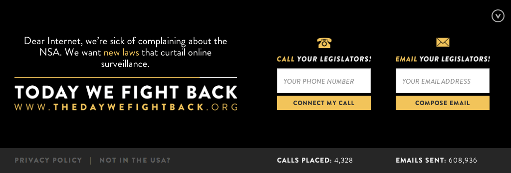
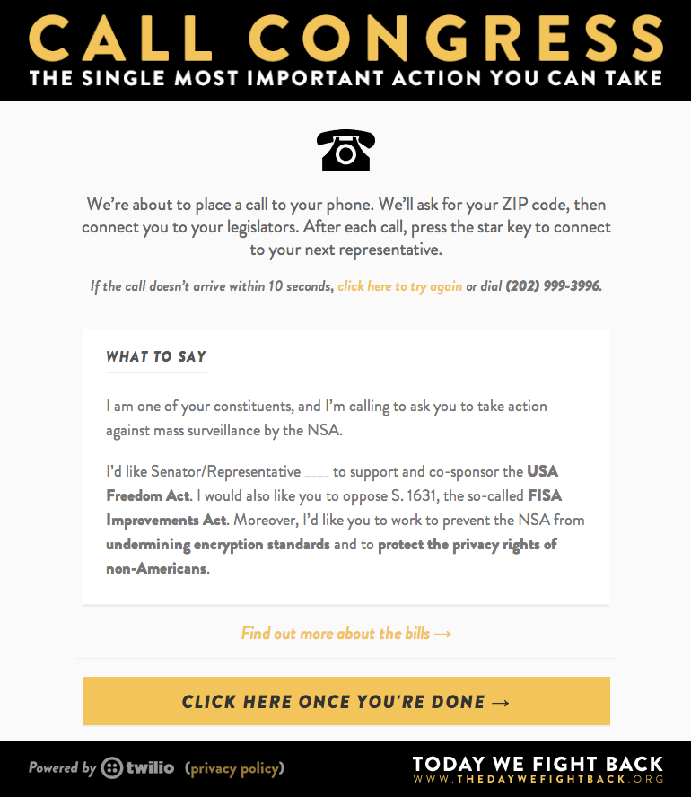
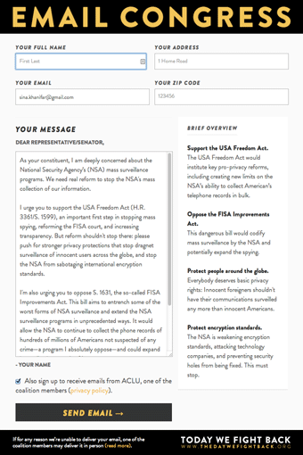

# thedaywefightback.js

_Please make pull requests with any fixes, and leave questions, suggestions and bugs on our [issue](http://github.com/tfrce/thedaywefightback.js/issues) page. We've tried our best to accomodate all browsers but  will fix any remaining issues before the 11th._

thedaywefightback.js is a javascript snippet that automatically activates at midnight of February 11th and adds a banner to your site for 24 hours in support of [thedaywefightback.org](https://thedaywefightback.org).

The goal is to drive as many phone calls and emails on the 11th. The calls are connected automatically by our a call server for free, thanks to Twilio.

<a href="http://tfrce.github.io/thedaywefightback.js/example/banner.html" target="_blank"></a>

**If you own a website, no matter how big or small, you can be part of this.**

## Demo pages

View the [US demo page](http://tfrce.github.io/thedaywefightback.js/example/banner.html) or the [international demo page](http://tfrce.github.io/thedaywefightback.js/example/banner_international.html) - (unless explicitly set the banner uses GeoIP to detect your location).

## Getting started

You can add the snippet to your site now - it won't be activated until midnight EST on February 11th and will remain active for 26 hours.

Simply copy and paste the code below into your website, right above the closing `<body>` tag.

_Place the code below before `</body>` tag. The script loads asynchronously and won't affect page load times._

```html
<!--[if !(lte IE 8)]><!-->
<script type="text/javascript"> 
  // @license magnet:?xt=urn:btih:0b31508aeb0634b347b8270c7bee4d411b5d4109&dn=agpl-3.0.txt GPL-v3-or-Later
  (function(){
    var e = document.createElement('script'); e.type='text/javascript'; e.async = true;
    e.src = document.location.protocol + '//d1agz031tafz8n.cloudfront.net/thedaywefightback.js/widget.min.js';
    var s = document.getElementsByTagName('script')[0]; s.parentNode.insertBefore(e, s);
  })();
  // @license-end
</script>
<!--<![endif]-->

```

The widget supports all screen sizes and platforms, if you encounter a bug please let us know on the [issues](http://github.com/tfrce/thedaywefightback.js/issues) page.

The counts will reset on the day, and only the additions on the 11th will contribute to the total.

## Customize the banner

You can choose a different banner style and customize the preferences using a javascript object:

```html
<script type="text/javascript"> 
  // @license magnet:?xt=urn:btih:0b31508aeb0634b347b8270c7bee4d411b5d4109&dn=agpl-3.0.txt GPL-v3-or-Later
  // The defaults are set below
  var tdwfb_config = {
    greeting: 'Dear Internet Users', // Sets the salutation at the top left.
    disableDate: false, // If true, the banner shows even if the date is not yet 02/11/2014
    callOnly: false // If true, the banner only displays a form for calling congress
  };
  (function(){
    var e = document.createElement('script'); e.type='text/javascript'; e.async = true;
    e.src = document.location.protocol + '//d1agz031tafz8n.cloudfront.net/thedaywefightback.js/widget.min.js';
    var s = document.getElementsByTagName('script')[0]; s.parentNode.insertBefore(e, s);
  })();
  // @license-end
</script>
```

## Other ways to install the banner

A Cloudflare app and Wordpress plugin will be added soon.

## Questions

Please feel free to fork and submit pull requests for any bugs or quirks you might find. thedaywefightback.js's code is licensed under the terms of the [GNU Affero General Public License](https://gnu.org/licenses/agpl) version 3, or, at your option, any later version (See [./COPYING](./COPYING)

Built by [Taskforce.is](http://taskforce.is) members [Thomas Davis](https://twitter.com/neutralthoughts) and [Sina Khanifar](https://github.com/sinak/).

**A big thank you to [Twilio](https://www.twilio.com/) for sponsoring calls and [Rob Spectre](https://twitter.com/dN0t) for all his help.**


- Submit a pull request or <a href="https://twitter.com/home?status=@sinak Please add our XXX to the list of sites participating in Project Megaphone" target="_blank">tweet</a> to be added here.


## Screenshots

### Main Banner


### Call Tool Pop-up


### Email Tool Pop-up

