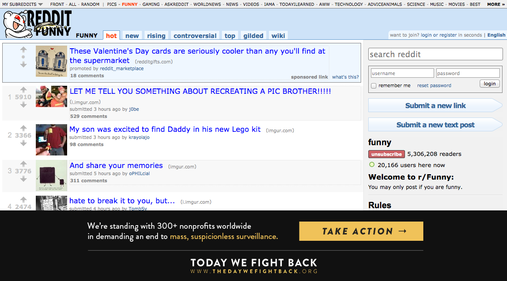

##Installing the banner on your subreddit

You can install a static banner on your subreddit to show your support for The Day We Fight Back. Here's what it looks like:




###READ BEFORE INSTALLING

* **This won't activate automatically.** You'll have to add and remove it yourself.
* **This banner doesn't include the call/email forms.** Users will be taken to thedaywefightback.org on click instead. Because of this, we ask that you wait until closer to February 11th.

##Instructions

1. Upload **[this image](./thedaywefightback/static/tdwfb-banner-static.png)** to your subreddit (under **Subreddit settings > Stylesheet settings**)
2. Add this css to the **bottom** of your stylesheet.

````.side a[title="tdwfb"] {
        position:fixed;
        bottom:0;
        left:0;
        display:block;
        height:160px;
        width:100%;
        font-size:0em;
        background:#111 url(%%tdwfb-banner-static%%) no-repeat center center;
        z-index: 9999999;
    }
    html {
        padding-bottom:160px;
}````

3. Finally, go back to **Subreddit Settings** and add the following to the bottom of your sidebar.

````[Help stand up for an open Internet: The Day We Fight Back &rarr;](http://thedaywefightback.org "tdwfb")````
    
